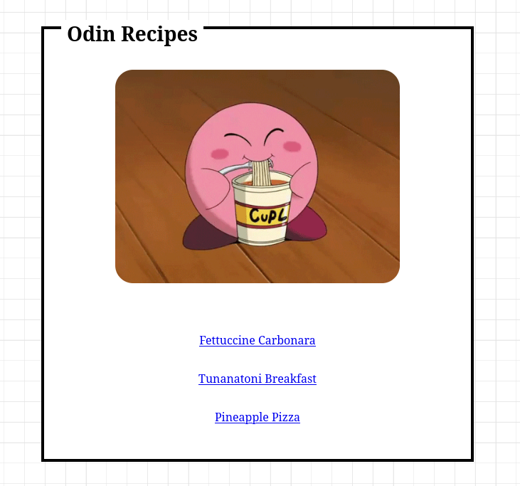

This is the first project from the odin project. Its meant to be a very basic html only recipes website. I hope you enjoy my recipes! I want to add styles to this website and make it more robust in the future but for now I prefer to be focused on these lessons.

## Table of contents

- [Overview](#overview)
  - [Screenshot](#screenshot)
  - [Links](#links)
- [My process](#my-process)
  - [Built with](#built-with)

## Overview

### Screenshot

### Links

- The Odin Project Lesson: [https://www.theodinproject.com/lessons/foundations-recipes](https://www.theodinproject.com/lessons/foundations-recipes)
- Live Site URL: [https://andrecaldeiras.github.io/odin-recipes/index.html](https://andrecaldeiras.github.io/odin-recipes/index.html)

## My process

### Built with

- Semantic HTML5 markup